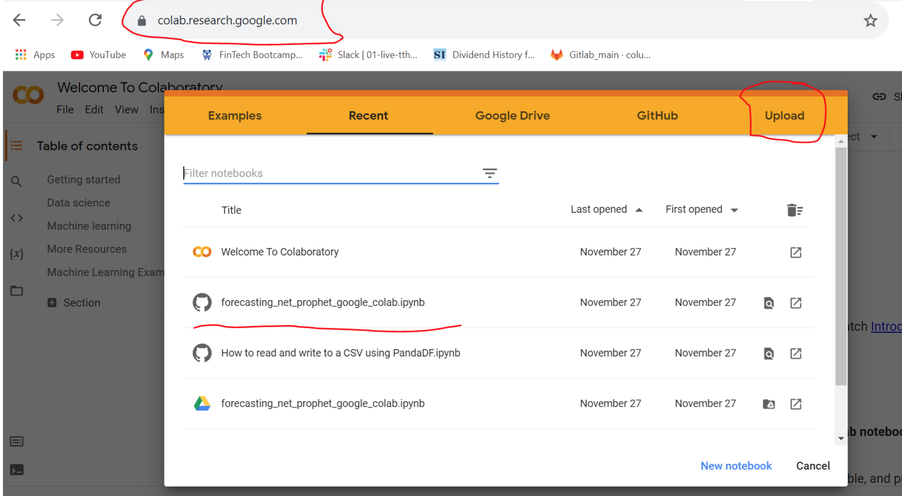
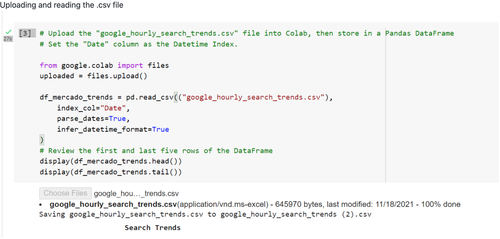
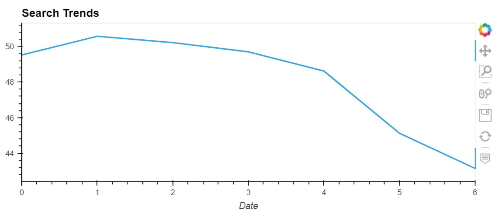
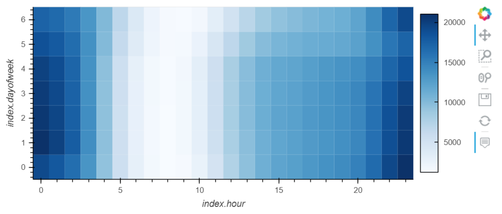
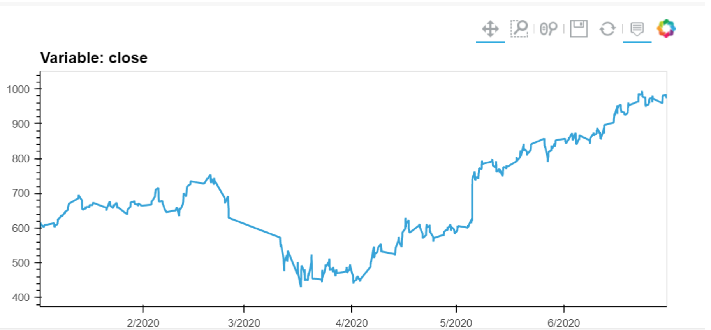
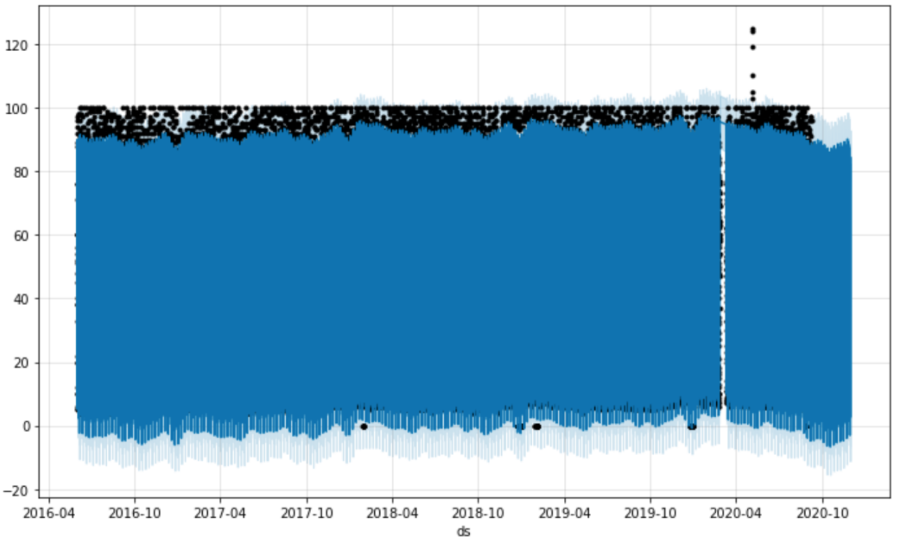
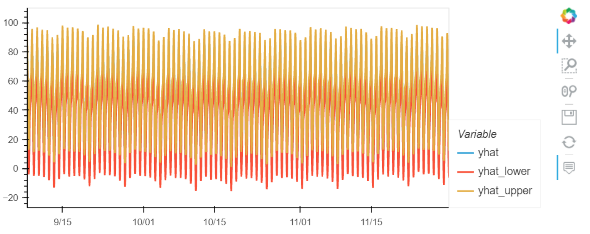
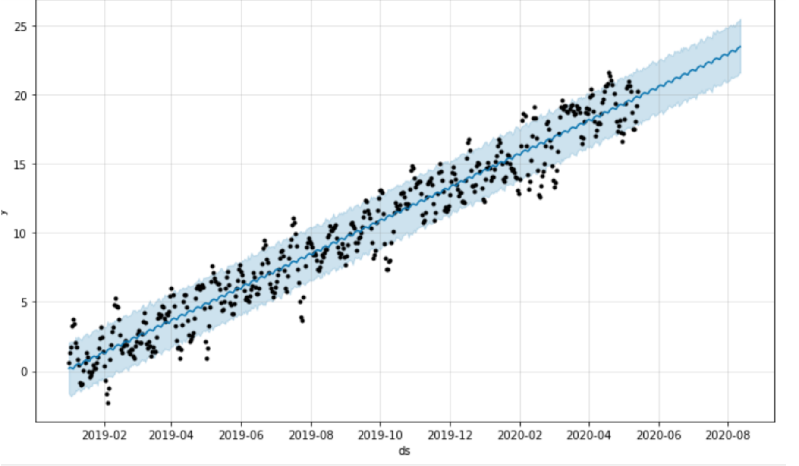

<!-- header is made with: https://github.com/kyechan99/capsule-render -->

[Stephane Masyn](https://www.linkedin.com/in/stephane-masyn-35b16817a/) 
                                 

---

### Table of Contents

* [Overview](#overview)
* [Requirements](#requirements)
* [Visualization](#visualization)
* [User Experience](#user-experience)
* [License](#license)  

---

## Overview

This program will allow one to analyze MercadoLibre's financial and user data in clever ways to provide insight to help the company grow. You will be able to predict search traffic so you can translate into the ability to successfully trade the stock.

---

## Requirements

This project leverages python 3.7, Google Colaboratory and Facebook Prophet library. You will install pystan and fbprohet temporarily on memory in the cloud while using the program on goole colab.

!pip install pystan
!pip install fbprophet 

---

## User Experience

To use this application simply clone the repository and save forecasting_net_prophet_google_colab.ipynb in the Jupyter Notebook. Then go to the https://colab.research.google.com/ to launch google colab and upload forecasting_net_prophet_google_colab.ipynb that saved to your jupyter notebook.

---

## Visualization

Get started using your jupyter notebook on Google Colab

Installing liabraries and modules on the cloud

Uploading and reading the .csv file

Plot of google search trends

Heatmap of google searches by hour

Close price during first half of 2020

Plot predictions

The following 'yhat' represents Most Likely', 'yhat_lower' represents 'Worst Case' and 'yhat_upper'shows the 'Best Case' scenarios

Visualize the forecast results 

---

## License

MIT License

Copyright (c) 2022 Stephane Masyn

Permission is hereby granted, free of charge, to any person obtaining a copy
of this software and associated documentation files (the "Software"), to deal
in the Software without restriction, including without limitation the rights
to use, copy, modify, merge, publish, distribute, sublicense, and/or sell
copies of the Software, and to permit persons to whom the Software is
furnished to do so, subject to the following conditions:

The above copyright notice and this permission notice shall be included in all
copies or substantial portions of the Software.

THE SOFTWARE IS PROVIDED "AS IS", WITHOUT WARRANTY OF ANY KIND, EXPRESS OR
IMPLIED, INCLUDING BUT NOT LIMITED TO THE WARRANTIES OF MERCHANTABILITY,
FITNESS FOR A PARTICULAR PURPOSE AND NONINFRINGEMENT. IN NO EVENT SHALL THE
AUTHORS OR COPYRIGHT HOLDERS BE LIABLE FOR ANY CLAIM, DAMAGES OR OTHER
LIABILITY, WHETHER IN AN ACTION OF CONTRACT, TORT OR OTHERWISE, ARISING FROM,
OUT OF OR IN CONNECTION WITH THE SOFTWARE OR THE USE OR OTHER DEALINGS IN THE
SOFTWARE.

---
