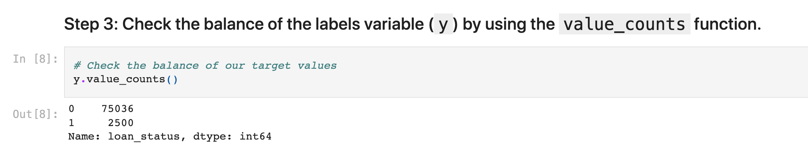
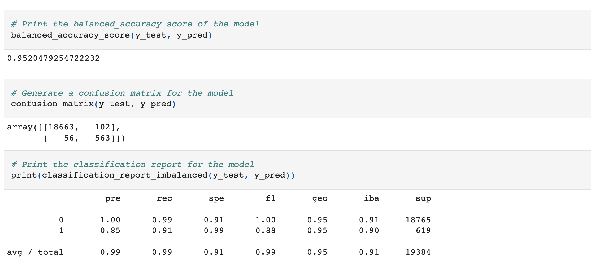
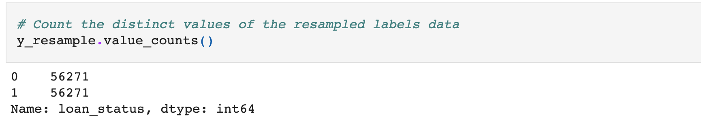
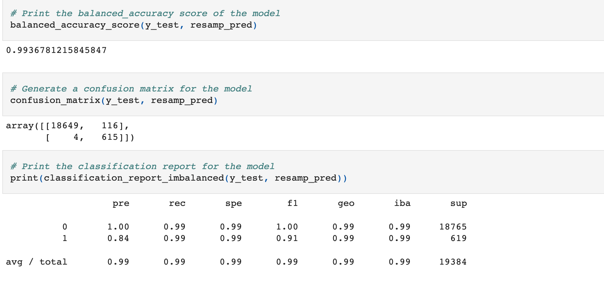

<!-- header is made with: https://github.com/kyechan99/capsule-render -->

[Stephane Masyn](https://www.linkedin.com/in/stephane-masyn-35b16817a/) 

### Table of Contents

* [Overview](#overview)
* [Technologies](#Technologies)
* [Usage](#Usage)
* [Visualization](#Visualization)
* [License](#license)  

## Overview

In this program, I've used various techniques to train and evaluate models with imbalanced classes. You’ll use a dataset of historical lending activity from a peer-to-peer lending services company to build a model that can identify the creditworthiness of borrowers. You will be able to use a logistic regression model to compare two versions of the dataset, original and resampled. 

---

## Technologies

https://scikit-learn.org/stable/modules/generated/sklearn.linear_model.LogisticRegression.html

This project leverages python 3.7, imbalanced-learn and PyDotPlus libraries. You will install Install imbalanced-learn and PyDotPlus by installing in your conda dev environment in your terminal.

conda install -c conda-forge imbalanced-learn
conda install -c conda-forge pydotplus

---

## Usage

To use this application simply clone the repository and run credit_risk_resampling.ipynb on your Jupyter Notebook.

---

## Sample Visualization and Metrics

Value Counts for original dataset...

Balance Accuracy, Confision Matrix & Classification Report of original dataset

Value Counts for resampled dataset...

Balance Accuracy, Confision Matrix & Classification Report of Resampled dataset

---

## License

MIT License

Copyright (c) 2022 Stephane Masyn

Permission is hereby granted, free of charge, to any person obtaining a copy of this software and associated documentation files (the "Software"), to deal in the Software without restriction, including without limitation the rights to use, copy, modify, merge, publish, distribute, sublicense, and/or sell copies of the Software, and to permit persons to whom the Software is furnished to do so, subject to the following conditions:

The above copyright notice and this permission notice shall be included in all copies or substantial portions of the Software.

THE SOFTWARE IS PROVIDED "AS IS", WITHOUT WARRANTY OF ANY KIND, EXPRESS OR IMPLIED, INCLUDING BUT NOT LIMITED TO THE WARRANTIES OF MERCHANTABILITY, FITNESS FOR A PARTICULAR PURPOSE AND NONINFRINGEMENT. IN NO EVENT SHALL THE AUTHORS OR COPYRIGHT HOLDERS BE LIABLE FOR ANY CLAIM, DAMAGES OR OTHER LIABILITY, WHETHER IN AN ACTION OF CONTRACT, TORT OR OTHERWISE, ARISING FROM, OUT OF OR IN CONNECTION WITH THE SOFTWARE OR THE USE OR OTHER DEALINGS IN THE SOFTWARE.

---
