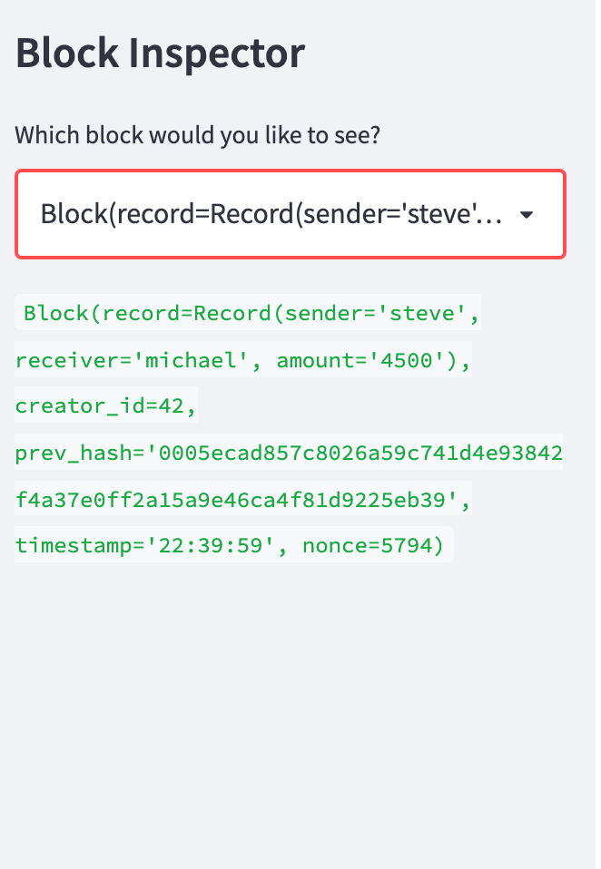
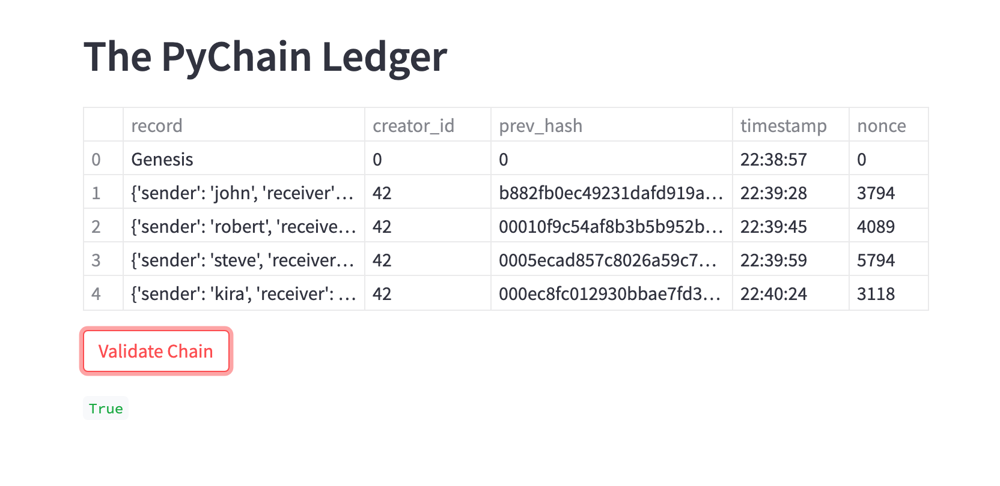

<!-- header is made with: https://github.com/kyechan99/capsule-render -->

[Stephane Masyn](https://www.linkedin.com/in/stephane-masyn-35b16817a/) 
                                 

---

### Table of Contents

* [Overview](#overview)
* [Requirements](#requirements)
* [Visualization](#visualization)
* [User Experience](#user-experience)
* [License](#license)  

---

## Overview

pychain.py is an application that allows the user to build a blockchain ledger. While Python was used for the back-end code, Streamlit enhances the front-end user experience. This ledger allows the user to conduct financial transactions and validate them to the blockchain. 

---

## Requirements

This project leverages python 3.7 and Streamlit.

A [conda](https://docs.conda.io/en/latest/) environment with liabraries listed below and [Jupyter Notebook/Lab](https://jupyter.org/) are required to run the code.

The following library was used:

2. [Streamlit](https://streamlit.io/) - Streamlit turns data scripts into shareable web apps in minutes.

Install the following librarie(s) in your terminal...

    pip install streamlit
 
---

## Visualization

## PyChain Ledger Demo using Streamlit:

https://user-images.githubusercontent.com/89653430/150596077-2510dafb-5674-4b84-9416-f6c971ed7731.mp4

## Screenshot of the contents and hashes detailing a block of the blockchain:

## Streamlit application page, indicating the validity of the blockchain:

---

## User Experience

The streamlit app is run form your terminal and open on a localhost. To use this application, open your environement and type: streamlit run pychain.py.

Or you can also click the link below and experience it online. 

1) CLICK https://share.streamlit.io/stefimaz/fintech_bootcamp_challenges/main/C18_Blockchain_Python/pychain.py

---

## License

MIT License

Copyright (c) 2022 Stephane Masyn

Permission is hereby granted, free of charge, to any person obtaining a copy
of this software and associated documentation files (the "Software"), to deal
in the Software without restriction, including without limitation the rights
to use, copy, modify, merge, publish, distribute, sublicense, and/or sell
copies of the Software, and to permit persons to whom the Software is
furnished to do so, subject to the following conditions:

The above copyright notice and this permission notice shall be included in all
copies or substantial portions of the Software.

THE SOFTWARE IS PROVIDED "AS IS", WITHOUT WARRANTY OF ANY KIND, EXPRESS OR
IMPLIED, INCLUDING BUT NOT LIMITED TO THE WARRANTIES OF MERCHANTABILITY,
FITNESS FOR A PARTICULAR PURPOSE AND NONINFRINGEMENT. IN NO EVENT SHALL THE
AUTHORS OR COPYRIGHT HOLDERS BE LIABLE FOR ANY CLAIM, DAMAGES OR OTHER
LIABILITY, WHETHER IN AN ACTION OF CONTRACT, TORT OR OTHERWISE, ARISING FROM,
OUT OF OR IN CONNECTION WITH THE SOFTWARE OR THE USE OR OTHER DEALINGS IN THE
SOFTWARE.

---
