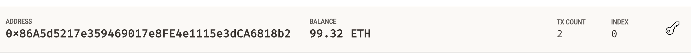

<!-- header is made with: https://github.com/kyechan99/capsule-render -->

[Stephane Masyn](https://www.linkedin.com/in/stephane-masyn-35b16817a/) 
                                 

---

### Table of Contents

* [Overview](#overview)
* [Requirements](#requirements)
* [Visualization](#visualization)
* [User Experience](#user-experience)
* [License](#license)  

---

## Overview

Fintech Finder is an application that its customers can use to find fintech professionals from among a list of candidates, hire them, and pay them. It integrates with the Ethereum blockchain network into in order to enable the customers to instantly pay the fintech professionals whom they hire with cryptocurrency.
While Python was used for the back-end code, Streamlit enhances the front-end user experience.

---

## Requirements

This project leverages python 3.7 and Streamlit, hashlib, web3, eth-tester, mnemonic and bip44.

The following libraries were used:

* [Streamlit](https://streamlit.io/) - Streamlit turns data scripts into shareable web apps in minutes.

* [hashlib](https://docs.python.org/3/library/hashlib.html)- This module implements a common interface to many different secure hash and message digest algorithms. In our application, we use SHA256 to return a hexdigest.

* [web3.py](https://web3py.readthedocs.io/en/stable/overview.html) - This is a Python library for connecting to and performing operations on Ethereum-based blockchains.

* [eth-tester](https://pypi.org/project/eth-tester/) - This is a Python library that provides access to the tools we’ll use to test Ethereum-based applications.

* [mnemonic](https://pypi.org/project/mnemonic/) - This is a Python implementation for generating a 12- or 24-word mnemonic seed phrase based on the BIP-39 standard.

* [bip44](https://pypi.org/project/bip44/) - This is a Python implementation for deriving hierarchical deterministic wallets from a seed phrase based on the BIP-44 standard.

Install the following librarie(s) in your terminal...

    pip install streamlit        
    pip install web3==5.17
    pip install eth-tester==0.5.0b3 or pip install eth-tester
    pip install mnemonic
    pip install bip44
  
---

## Visualization
 
### Screenshot of the Ganache dashboard address, balance, and transaction (TX) count:

  

### Screenshot of the Ganache transactions transaction information:

## Streamlit application page, indicating the validity of the blockchain:

---

## User Experience

The streamlit app is run form your terminal and open on a localhost. To use this application, open your environement and type: streamlit run fintech_finder.py.
Make sure all the file are present in the same folder.

---

## License

MIT License

Copyright (c) 2022 Stephane Masyn

Permission is hereby granted, free of charge, to any person obtaining a copy
of this software and associated documentation files (the "Software"), to deal
in the Software without restriction, including without limitation the rights
to use, copy, modify, merge, publish, distribute, sublicense, and/or sell
copies of the Software, and to permit persons to whom the Software is
furnished to do so, subject to the following conditions:

The above copyright notice and this permission notice shall be included in all
copies or substantial portions of the Software.

THE SOFTWARE IS PROVIDED "AS IS", WITHOUT WARRANTY OF ANY KIND, EXPRESS OR
IMPLIED, INCLUDING BUT NOT LIMITED TO THE WARRANTIES OF MERCHANTABILITY,
FITNESS FOR A PARTICULAR PURPOSE AND NONINFRINGEMENT. IN NO EVENT SHALL THE
AUTHORS OR COPYRIGHT HOLDERS BE LIABLE FOR ANY CLAIM, DAMAGES OR OTHER
LIABILITY, WHETHER IN AN ACTION OF CONTRACT, TORT OR OTHERWISE, ARISING FROM,
OUT OF OR IN CONNECTION WITH THE SOFTWARE OR THE USE OR OTHER DEALINGS IN THE
SOFTWARE.

---
