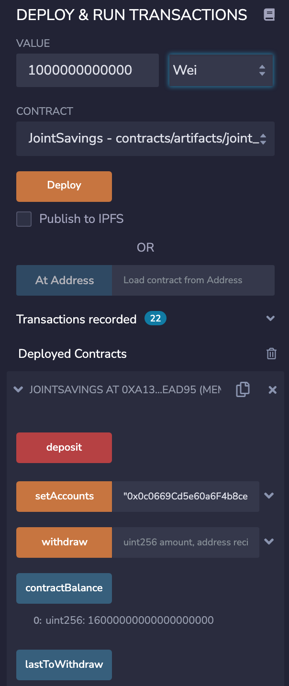
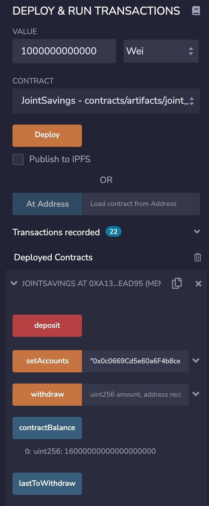
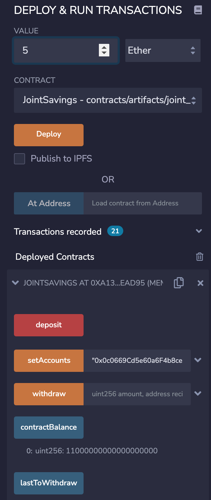
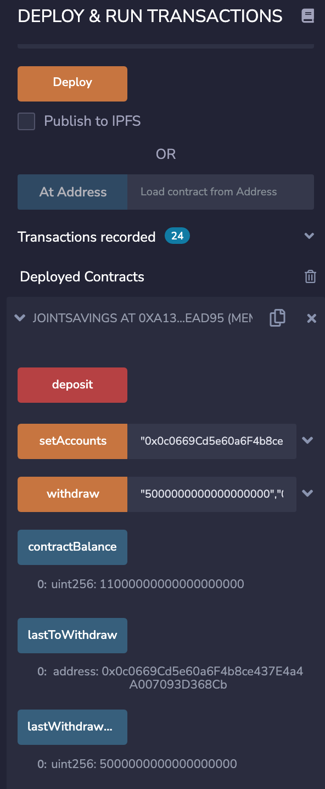
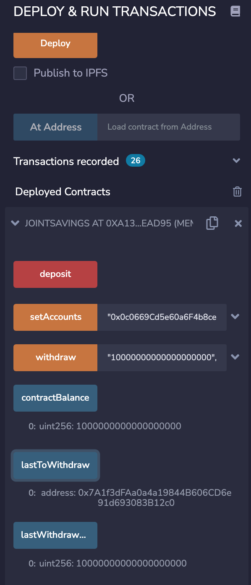

<!-- header is made with: https://github.com/kyechan99/capsule-render -->

[Stephane Masyn](https://www.linkedin.com/in/stephane-masyn-35b16817a/) 
                                 

---

### Table of Contents

* [Overview](#overview)
* [Requirements](#requirements)
* [Visualization](#visualization)
* [License](#license)  

---

## Overview

To automate the creation of joint savings accounts, this Solidity smart contract accepts two user addresses. These addresses will be able to control a joint savings account. This smart contract will use ether management functions to implement a financial institution’s requirements for providing the features of the joint savings account. These features will consist of the ability to deposit and withdraw funds from the account.

---

## Requirements

This project leverages Solidity 0.5.0.
The file was opened and creadted using Remix IDE. 
The remix IDE can be access here: https://remix.ethereum.org

---

## Visualization
 
### Screenshot of the transaction after deposit of initial amounts:
#### Transaction 1: Send 1 ether as wei.

#### Transaction 2: Send 10 ether as wei.

#### Transaction 3: Send 5 ether.

  

### Screenshot of testing the contract’s withdrawal functionality by withdrawing 5 ether into accountOne.

## Screenshot of testing the contract’s withdrawal functionality by withdrawing 10 ether into accountTwo. 

---

## License

MIT License

Copyright (c) 2022 Stephane Masyn

Permission is hereby granted, free of charge, to any person obtaining a copy
of this software and associated documentation files (the "Software"), to deal
in the Software without restriction, including without limitation the rights
to use, copy, modify, merge, publish, distribute, sublicense, and/or sell
copies of the Software, and to permit persons to whom the Software is
furnished to do so, subject to the following conditions:

The above copyright notice and this permission notice shall be included in all
copies or substantial portions of the Software.

THE SOFTWARE IS PROVIDED "AS IS", WITHOUT WARRANTY OF ANY KIND, EXPRESS OR
IMPLIED, INCLUDING BUT NOT LIMITED TO THE WARRANTIES OF MERCHANTABILITY,
FITNESS FOR A PARTICULAR PURPOSE AND NONINFRINGEMENT. IN NO EVENT SHALL THE
AUTHORS OR COPYRIGHT HOLDERS BE LIABLE FOR ANY CLAIM, DAMAGES OR OTHER
LIABILITY, WHETHER IN AN ACTION OF CONTRACT, TORT OR OTHERWISE, ARISING FROM,
OUT OF OR IN CONNECTION WITH THE SOFTWARE OR THE USE OR OTHER DEALINGS IN THE
SOFTWARE.

---
