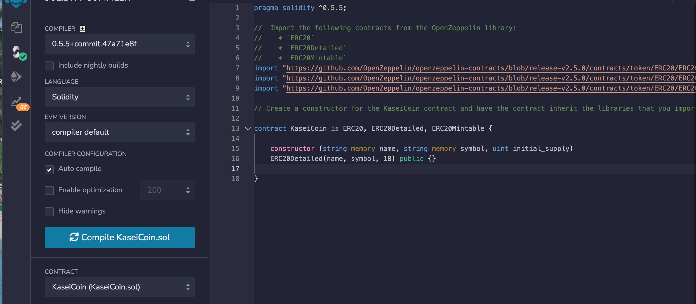
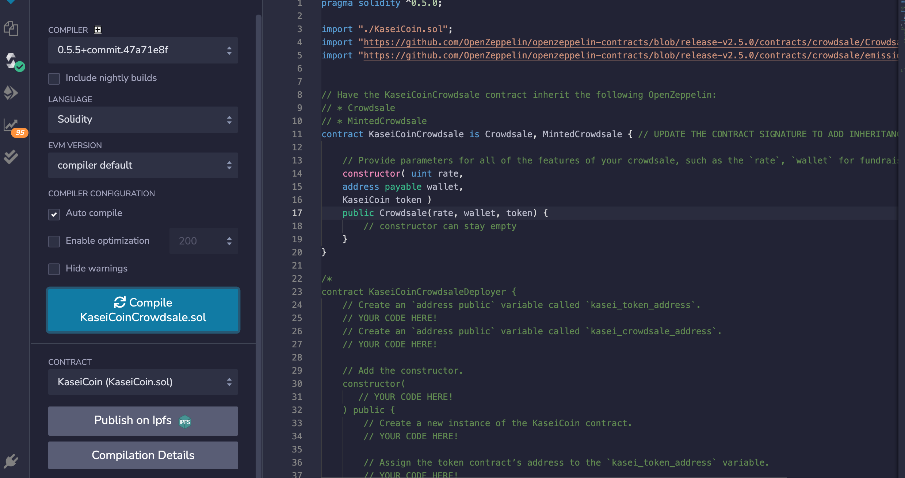
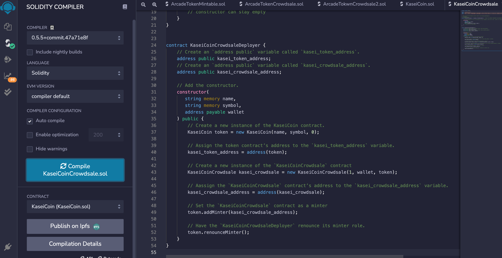
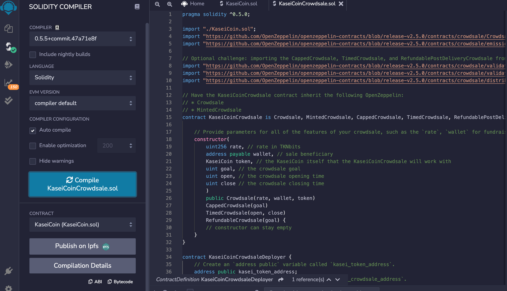
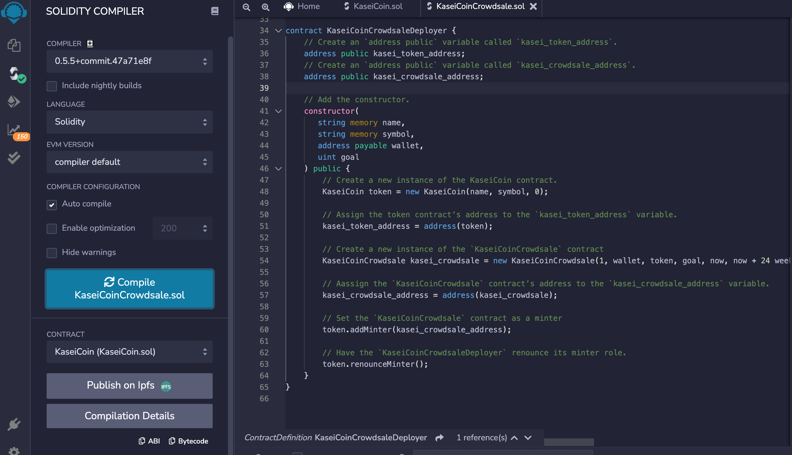

<!-- header is made with: https://github.com/kyechan99/capsule-render -->

[Stephane Masyn](https://www.linkedin.com/in/stephane-masyn-35b16817a/) 
                                 

---

### Table of Contents

* [Overview](#overview)
* [Requirements](#requirements)
* [Evaluation Evidence](#Evaluation-Evidence)
* [License](#license)  

---

## Overview

Creation of a fungible token that is ERC-20 compliant and that will be minted by using a Crowdsale contract from the OpenZeppelin Solidity library.

The crowdsale contract created will manage the entire crowdsale process, allowing users to send ether to the contract and in return receive KAI, or KaseiCoin tokens. The contract will mint the tokens automatically and distribute them to buyers in one transaction.

I extended the crowdsale contract to enhance its functionality. To do so, I use the following OpenZeppelin contracts:

* CappedCrowdsale: This contract allows you to cap the total amount of ether that may be raised during your crowdsale.
* TimedCrowdsale: This contract allows you to set a time limit for your crowdsale by adding an opening time and a closing time.
* RefundablePostDeliveryCrowdsale: Every time you launch a crowdsale, you set a goal amount of ether to raise. If the goal is not reached, it is common practice to refund your investors. This contract adds this capability to a crowdsale.

---

## Requirements

This project leverages Solidity 0.5.0.
The file was opened and creadted using Remix IDE. 
The remix IDE can be access here: https://remix.ethereum.org

---

## Evaluation Evidence
 
### Screenshot of the contracts compiled:
#### Kaseicoin Contract Compiled.

#### KaseiCoinCrowdsale Contract Compiled.

#### KaseiCoinCrowdsaleDeployer Contract Compiled.

  
### KaseiCoinCrowdsale With Enhance Functionality 

## Short video demonstration. 

---

## License

MIT License

Copyright (c) 2022 Stephane Masyn

Permission is hereby granted, free of charge, to any person obtaining a copy
of this software and associated documentation files (the "Software"), to deal
in the Software without restriction, including without limitation the rights
to use, copy, modify, merge, publish, distribute, sublicense, and/or sell
copies of the Software, and to permit persons to whom the Software is
furnished to do so, subject to the following conditions:

The above copyright notice and this permission notice shall be included in all
copies or substantial portions of the Software.

THE SOFTWARE IS PROVIDED "AS IS", WITHOUT WARRANTY OF ANY KIND, EXPRESS OR
IMPLIED, INCLUDING BUT NOT LIMITED TO THE WARRANTIES OF MERCHANTABILITY,
FITNESS FOR A PARTICULAR PURPOSE AND NONINFRINGEMENT. IN NO EVENT SHALL THE
AUTHORS OR COPYRIGHT HOLDERS BE LIABLE FOR ANY CLAIM, DAMAGES OR OTHER
LIABILITY, WHETHER IN AN ACTION OF CONTRACT, TORT OR OTHERWISE, ARISING FROM,
OUT OF OR IN CONNECTION WITH THE SOFTWARE OR THE USE OR OTHER DEALINGS IN THE
SOFTWARE.

---
